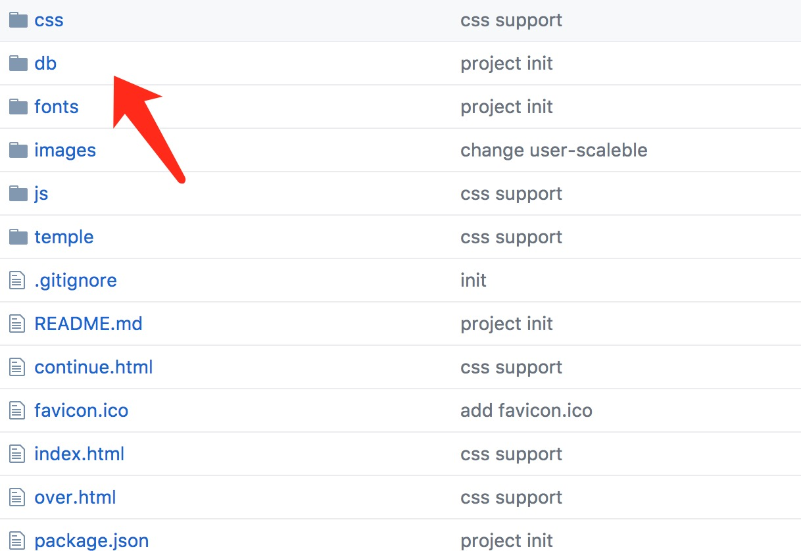
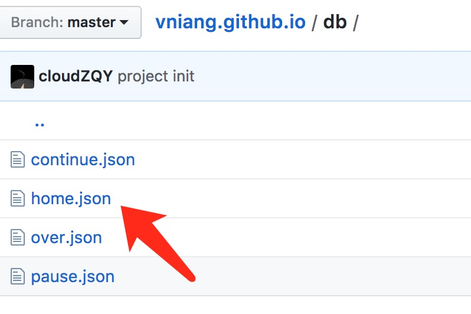
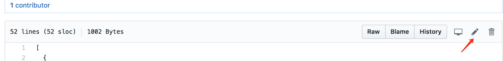
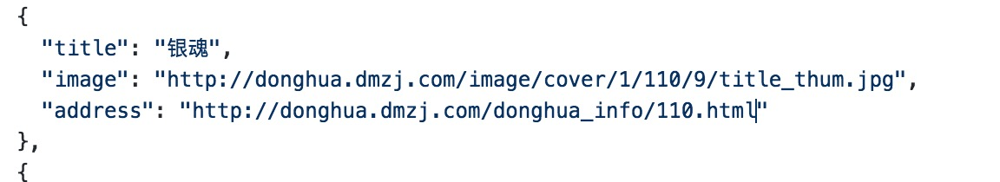
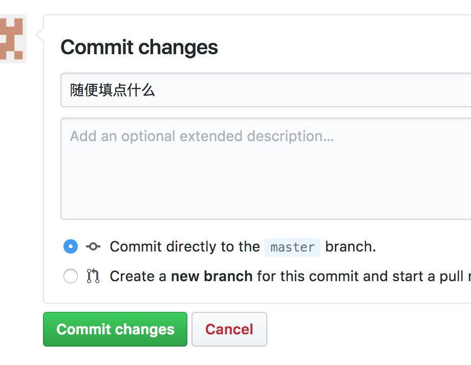

## 更改或添加漫画步骤漫画  

1. 打开文件夹  

  
  

此文件夹中的四个文件分别对应：  
`db/home.json` 首页推荐  
`db/continue.json` 连载/填坑中  
`db/over.json` 完结/停刊  
`db/pause.json` 暂停/弃坑  

  
然后打开其中一个点击右上角的笔进入编辑模式  

  
按文件中的格式进行添加和更改，千万注意逗号，添加漫画可用复制粘贴，记住最后一个漫画没有逗号。  
其中title是标题
image是封面地址
address是漫画地址

  
然后在下面第一输入随便填点信息，做为这次更改的记录点击绿色按钮就成功了！一般需要等待5分钟左右才能见到刷新效果。

